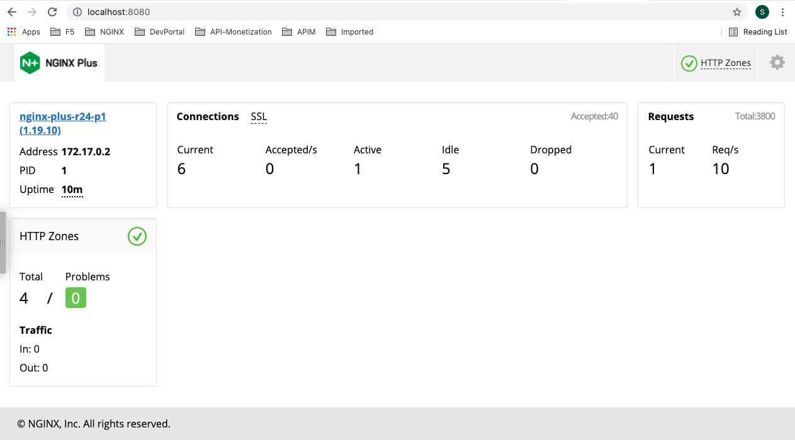

# Metrics Per-Location with API Key w/ API Client Name on NGINX Plus

## Creating a Docker Image of NGINX Plus
- Create a [Docerfile](./Dockerfile).
- Download your version of the nginx-repo.crt and nginx-repo.key files via the [customer portal](https://cs.nginx.com/?_ga=2.268586425.912746048.1620625839-85838359.1596947109).

## Creating the NGINX Plus Image

- Create a Docker image called `nginxplus`:
  ```bash
  # docker build --no-cache -t nginxplus .
  ```

- Check Docker image:
  ```bash
  # docker images nginxplus
  REPOSITORY   TAG       IMAGE ID       CREATED          SIZE
  nginxplus    latest    86ea343d2f20   36 seconds ago   88MB
  ```

- Create a container named mynginxplus based on this image:
  ```bash
  # docker run --name mynginxplus -p 90:80 -p 8080:8080 -d nginxplus
  ```

- Check Dashboard
  

- Call APIs to test API usages w/ API Key
  ```bash
  $ curl localhost:90/v1/api/1
    {"error": {"status": 401, "message": "Unauthorized"}}

  $ curl -H "apiKey: invalid-key" localhost:90/v1/api/1
    {"error": {"status": 403, "message": "Forbidden"}}
  
  $ curl -H "apiKey: 7B5zIqmRGXmrJTFmKa99vcit" localhost:90/v1/api/1
    {"code": "1", "message": "This is for testing status zone of /v1/api/1"}
  
  $ curl -H "apiKey: 7B5zIqmRGXmrJTFmKa99vcit" localhost:90/v1/api/2
    {"code": "2", "message": "This is for testing status zone of /v1/api/2"}
  
  $ curl -H "apiKey: 7B5zIqmRGXmrJTFmKa99vcit" localhost:90/v1/api/3
    {"code": "3", "message": "This is for testing status zone of /v1/api/3"}
  
  $ curl -H "apiKey: mGcjH8Fv6U9y3BVF9H3Ypb9T" localhost:90/v1/api/3
    {"code": "3", "message": "This is for testing status zone of /v1/api/3"}
  ```

- Check API usages per location
  ```
  $ curl localhost:8080/api/5/http/location_zones | python -m "json.tool"
  {
      "localhost_api_1": {
          "requests": 1,
          "responses": {
              "1xx": 0,
              "2xx": 1,
              "3xx": 0,
              "4xx": 0,
              "5xx": 0,
              "total": 1
          },
          "discarded": 0,
          "received": 118,
          "sent": 227
      },
      "localhost_api_2": {
          "requests": 1,
          "responses": {
              "1xx": 0,
              "2xx": 1,
              "3xx": 0,
              "4xx": 0,
              "5xx": 0,
              "total": 1
          },
          "discarded": 0,
          "received": 118,
          "sent": 227
      },
      "localhost_api_3": {
          "requests": 2,
          "responses": {
              "1xx": 0,
              "2xx": 2,
              "3xx": 0,
              "4xx": 0,
              "5xx": 0,
              "total": 2
          },
          "discarded": 0,
          "received": 236,
          "sent": 454
      },
      "localhost_api_4": {
          "requests": 0,
          "responses": {
              "1xx": 0,
              "2xx": 0,
              "3xx": 0,
              "4xx": 0,
              "5xx": 0,
              "total": 0
          },
          "discarded": 0,
          "received": 0,
          "sent": 0
      }
  }  ```

- Check API usages per server
  ```
  $ curl localhost:8080/api/5/http/server_zones | python -m "json.tool"
  {
      "localhost": {
          "processing": 0,
          "requests": 6,
          "responses": {
              "1xx": 0,
              "2xx": 4,
              "3xx": 0,
              "4xx": 2,
              "5xx": 0,
              "total": 6
          },
          "discarded": 0,
          "received": 661,
          "sent": 1324
      }
  }
  ```

## Reference
- [NGINX Plus Status Zone](https://www.nginx.com/blog/nginx-plus-r19-released/#new-features-detail)
- [NGINX API Key Authentication](https://www.nginx.com/blog/deploying-nginx-plus-as-an-api-gateway-part-1/)