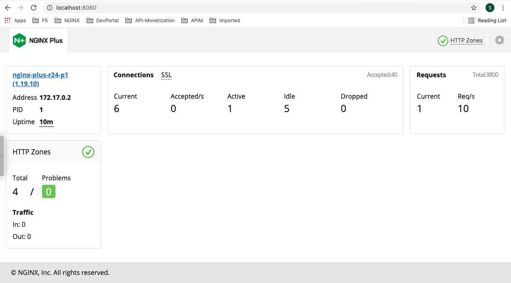
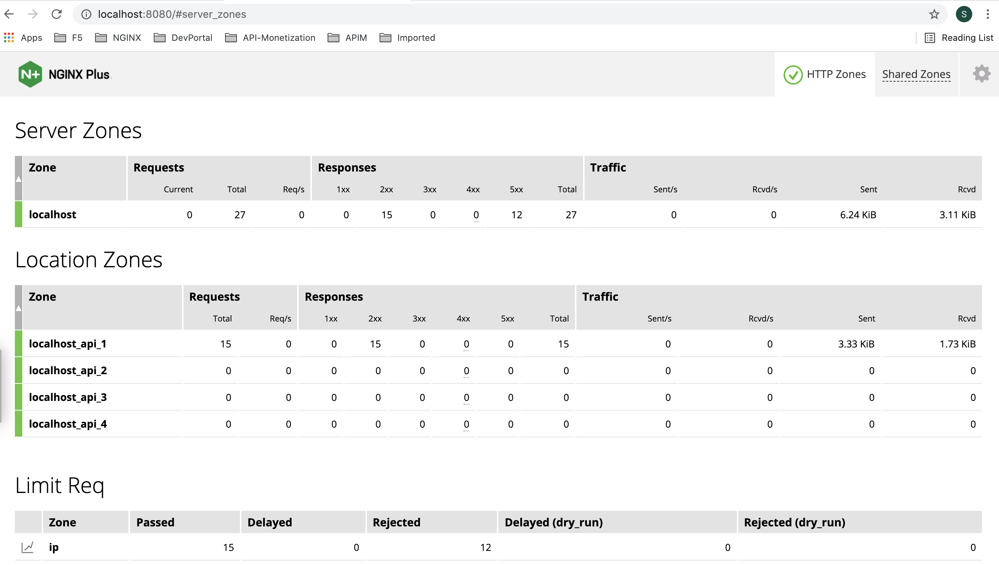

# Rate Limit w/ NGINX Plus

## Creating a Docker Image of NGINX Plus
- Create a [Docerfile](./Dockerfile).
- Download your version of the nginx-repo.crt and nginx-repo.key files via the [customer portal](https://cs.nginx.com/?_ga=2.268586425.912746048.1620625839-85838359.1596947109).

## Creating the NGINX Plus Image

- Create a Docker image called `nginxplus`:
  ```bash
  # docker build --no-cache -t nginxplus-debian .
  ```

- Check Docker image:
  ```bash
  # docker images nginxplus
  REPOSITORY   TAG       IMAGE ID       CREATED          SIZE
  nginxplus    latest    86ea343d2f20   36 seconds ago   88MB
  ```

- Create a container named mynginxplus based on this image:
  ```bash
  # docker run --name mynginxplus-debian -p 96:80 -p 8086:8080 -d nginxplus-debian
  ```

- Check Dashboard
  

- Call APIs to test rate limit w/ API Key
  - 5 requests per second
    ```bash
    $ curl -H "apiKey: 7B5zIqmRGXmrJTFmKa99vcit" localhost:90/v1/api/1
      {"code": "1", "message": "This is for testing status zone of /v1/api/1"}
      
    $ curl -H "apiKey: 7B5zIqmRGXmrJTFmKa99vcit" localhost:90/v1/api/1
      {"code": "1", "message": "This is for testing status zone of /v1/api/1"}
    
    $ curl -H "apiKey: 7B5zIqmRGXmrJTFmKa99vcit" localhost:90/v1/api/1
      {"error": {"status": 503, "message": "Service Temporarily Unavailable"}}

    $ curl -H "apiKey: 7B5zIqmRGXmrJTFmKa99vcit" localhost:90/v1/api/1
      {"code": "1", "message": "This is for testing status zone of /v1/api/1"}

    $ curl -H "apiKey: 7B5zIqmRGXmrJTFmKa99vcit" localhost:90/v1/api/1
      {"error": {"status": 503, "message": "Service Temporarily Unavailable"}}
    ```
    

## Reference
- [NGINX Plus Status Zone](https://www.nginx.com/blog/nginx-plus-r19-released/#new-features-detail)
- [NGINX API Key Authentication](https://www.nginx.com/blog/deploying-nginx-plus-as-an-api-gateway-part-1/)